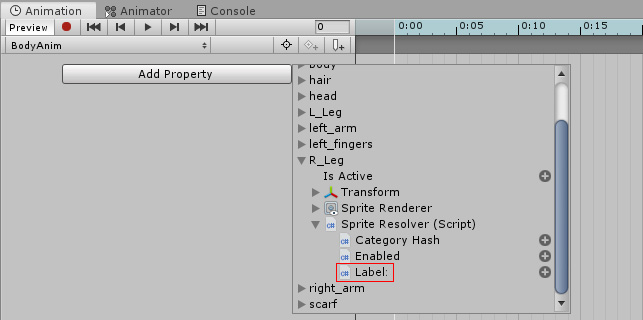

# Frame-by-Frame Animation

You can use Sprite Swap to quickly swap the Sprites rendered at run time, to create a frame-by-frame animation. This is useful for simple animations, such as to show a character blinking. It is recommended that you [change the keyframe tangent](#Change-the-keyframe-tangent) setting in the Animation window first before following the workflow below:

1. Place the Sprites for each animation frame in the [Sprite Library Asset](SLAsset.md), and assign them all to the same __Category__.  Give each Sprite a __Label__. Label names must be unique in their Category.

2. Select your character Prefab, and bring it into the Scene.

3. Open the [Animation](https://docs.unity3d.com/Manual/AnimationOverview.html) window, and select your character Prefab. and Select the __Add Property__ button, and select the [Sprite Resolver component](SRComponent.md)’s __Label__ property. 

   

4. Change the __Label__ property at each keyframe in the Animation window in order of your Animation frames. This simulates a frame-by-frame animation style.

## Change the Keyframe Tangent

When animating with the Category and Label value of the Sprite Resolver in the Animation window, it is important to change the keyframe’s tangent in the Animation window to __Constant__.

This is because the Sprite Resolver component uses the defined string hash value to locate the desired Sprite. If the values between keyframe’s are interpolated, the Sprite Resolver will not be able to resolve to the correct Sprite.