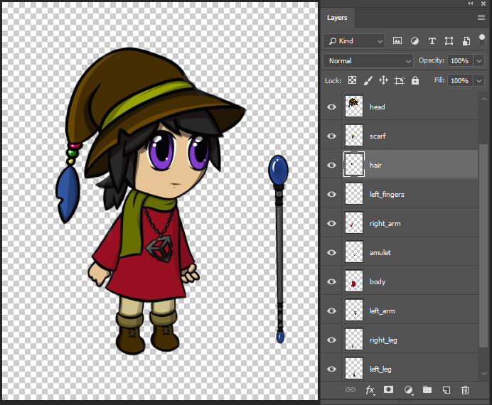

# Preparing And Importing Artwork

To prepare character artwork to animate with the 2D Animation package, arrange and separate the individual parts of your character onto different Layers (see Fig. 1) in Photoshop. The [PSD Importer](https://docs.unity3d.com/Packages/com.unity.2d.psdimporter@latest/index.html?preview=1) imports the graphic data from each Photoshop layer and automatically arranges the individual Layers into both a Sprite Sheet and a Prefab with the Sprite in their original positions (see Fig 2).

Fig 1: Layered character artwork in Adobe Photoshop.

Fig. 2: The different parts/Layers of the character arranged into a Sprite Sheet layout.

## Photoshop File and PSD Importer Settings

Prepare the character artwork by separating the character's limbs and parts into separate layers and then arrange them in a default pose.

1. Save your artwork as a PSB file in Adobe Photoshop by selecting the __Large Document Format__ under the __Save As__ menu. You can convert an existing PSD file to PSB in the same way.

2. Import the PSB file into Unity as an Asset.

3. Select the Asset to bring up the [PSD Importer](https://docs.unity3d.com/Packages/com.unity.2d.psdimporter@latest/index.html?preview=1) Inspector window.

4. In the Inspector window, ensure the following settings are set:

   - Set Texture Type to __Sprite(2D and UI)__.
   - Set Sprite Mode to __Multiple__.
   - Check the __Mosaic __checkbox.
   - Check the __Character Rig __checkbox.
   - Check the __Use Layer Grouping__ checkbox if you want to preserve any Layer Groups in the PSB file.

     
     Importer Window settings

Click __Apply__ to apply the settings. Refer to the [PSD Importer](https://docs.unity3d.com/Packages/com.unity.2d.psdimporter@latest) documentation for more information about these import settings.
