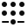

# Skinning Editor

The __Skinning Editor__ becomes available in the __Sprite Editor__ after you install the 2D Animation package. The Skinning Editor is your main tool for creating the skeleton rig and weights necessary for animation from your [imported](PreparingArtwork.md) character artwork.

To select the __Skinning Editor__ follow the steps below:

1. Select the imported Asset and select the __Sprite Editor__.
2. Select the __Skinning Editor__ module from the dropdown menu in the __Sprite Editor__ window. The following options and tools then appear.

The following are the Skinning Editor’s tools, their functions, and shortcuts:

| Tool                                                         | Default Shortcut | Function                                                     |
| :----------------------------------------------------------- | :--------------: | :----------------------------------------------------------- |
|  __Reset Pose__ |    Shift + 1     | Restore a character’s bones and joints to their original positions. |
|  __Toggle View Mode__ |    Shift + 2     | Switch between the Character and Sprite Sheet view           |
|  __Copy__             |     Ctrl + C     | Copy the data from the current selection.                    |
|  __Paste__          |     Ctrl + V     | Pastes the copied data.                                      |
|  __Paste__          |    Shift + B     | Show additional pasting options.                             |
|  __Visibility__ |    Shift + P     | Toggle visibility of selected Sprites or bones.              |
|  __Preview Pose__ |    Shift + Q     | Preview character poses after rigging.                       |
|  __Edit Joints__ |    Shift + W     | Reposition the bones into a new positions. These changes are automatically saved as the default bind pose for the Restore Bind Pose tool. Sprite geometry does not deform with the bones in this mode, even if the bones are attached as influencers. |
|  __Create Bone__ |    Shift + E     | Click and drag to create bones.                              |
|  __Split Bone__ |    Shift + R     | Splits the selected bone.                                    |
|  __Auto Geometry__ |    Shift + A     | Select to auto-generate Meshes for Sprites.                  |
|  __Edit Geometry__ |    Shift + S     | Edit generated Meshes by repositioning vertices.             |
|  __Create Vertex__ |    Shift + J     | Create new vertices to create geometry.                      |
|  __Create Edge__ |    Shift + G     | Create new edges to create geometry.                         |
|  __Split Edge__ |    Shift + H     | Split an existing edge into two.                             |
|  __Auto Weights__ |    Shift + Z     | Auto-generate weights for geometry.                          |
|  __Weight Slider__ |    Shift + X     | Adjust weights via slider control.                           |
|  __Weight Brush__ |    Shift + N     | Adjust weights by painting with a brush.                     |
|  __Bone Influence__ |    Shift + V     | Select which bones influence a Sprite.                       |
| __Toggle Tool Text__                                         |    Shift + `     | Show or hide text on tool buttons.                           |

The [Sprite Visibility panel](SpriteVis.md) is found on the right side of the Skinning Editor. It controls the visibility of the Sprite Meshes and bones in the Skinning Editor window, and displays the Sprites according to their Layer and Group order in the source art file (see image below). Refer to the [Sprite Visibility panel](SpriteVis.md) page for more details of the panel’s functions.

## Selecting a Sprite

To select a Sprite in the Skinning Editor window:
1. Double-click a Sprite to select it.
2. If there are multiple Sprites that overlay each other, double-click to cycle through all Sprites at the cursor location.
3. Double-click on a blank area to deselect all Sprites.

## Selecting Bone and Mesh Vertices

To select a bone or Mesh vertex: 

1. Click a bone or Mesh vertex to select it.
2. Click and drag a selection box over multiple bones or vertices to select them at once.
3. Right click to deselect any selected bone or Mesh vertices.