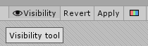
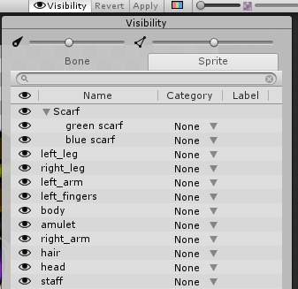
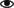
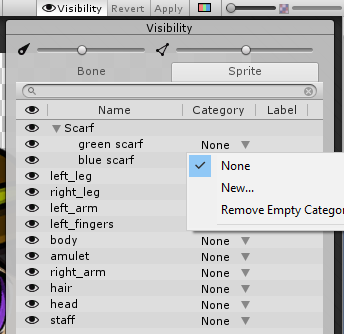
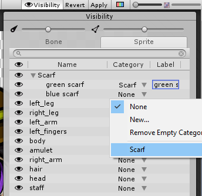
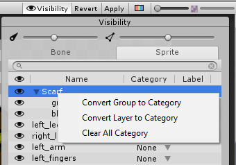

# Sprite Visibility panel

Toggle the __Sprite Visibility panel__ by selecting the __Visibility__ button along the top right of the __Skinning Window__: 

The panel appears on the right-side of the editor window. It has two sliders at the top that control the visibility of the bones and Sprite meshes within the editor window. Move either slider further to the left to decrease the visibility of the bones or meshes respectively, and to the right to increase their visibility. 

The panel has two main tabs - __Bone__ and __Sprite__. Both tabs show either the order of bones or Sprite meshes of the currently selected Character rig respectively. 

Select the Bone tab bring up the bone hierarchy tree of the Character Rig. You can reparent and reorder bones by dragging them along the list, and toggle the visibility of each bone by selecting the  icon next to it.

Select the Sprite tab to see the list of Sprite meshes in the Skinning editor window. The names and order of the Sprites mirror their names, layer and grouping order in the original PSB source file. 

The Sprite tab has two additional columns for the __Category__ and __Label__ of each Sprite in the character prefab. A Category contains a collection of Sprites that are differentiated by their Labels, and these two properties are found in the [Sprite Library Asset](SLAsset.md) that Unity automatically creates when a PSB file is imported with the [PSD Importer](https://docs.unity3d.com/Packages/com.unity.2d.psdimporter@latest). These two properties are part of the [Sprite Swapping](SpriteSwapIntro.md) workflow, and enables several possible [functions and uses](Examples.md), such as creating [frame-by-frame animations](FFanimation.md). 

## Creating a new Category in the Visibility Panel

1. Go to the row of the Sprite, open the drop-down menu on the Category column and select __New__.

   

   

2. Enter a name for the Category. This name must be unique among other Categories within the same Library Asset.

3. When you enter a Category name, Unity automatically assigns that Sprite a Label based on the Sprite’s name, which you can edit. Labels belonging to the same Category must have unique names.

4. To assign the Sprite to an existing Category, open the drop-down menu on the Category column along its roll, and select from the list of existing Categories.

   

## Context Menu options

There are context menu options available from the Visibility panel to create Categories and Labels based on the groups and layer names of the Sprites. Open the context menu by right-clicking the row of the Sprite or Group you want to convert to a Category.

| Option                        | Function                                                     |
| ----------------------------- | ------------------------------------------------------------ |
| __Convert Group to Category__ | This option is only available if the selected row is a Group that contains multiple Sprites. Select this option to assign all Sprites in the group to a new Category. Unity automatically names the new Category with the root Group name. |
| __Convert Layer to Category__ | Select this option to assign the Sprite to a Category based on the Sprite’s name. Unity also uses the Sprite's name as the Label name. |
| __Clear All Category__        | Select this to remove all selected Sprites from their currently assigned Categories. |