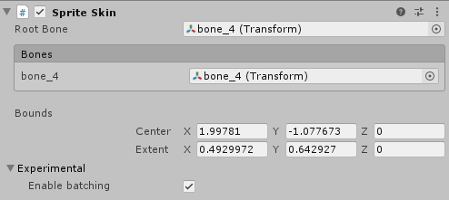

# Introduction to 2D Animation

This documentation contains information on how to quickly rig and animate a 2D character in Unity with the 2D Animation package and tools. The following package versions are only supported for the following Unity versions:

- __Unity 2019.3__ - 2D Animation version 3.0.5
- __Unity 2019.2__ - 2D Animation version 2.2.0-preview.6

## Adobe Photoshop PSB format

For character animation with the __2D Animation package__, the [PSD Importer package](https://docs.unity3d.com/Packages/com.unity.2d.psdimporter@latest/index.html?preview=1) is required. The PSD Importer package currently only supports the __Adobe Photoshop PSB format__, and does not support the Adobe PSD format. The PSB format has identical functions as PSD, with the additional support for much larger image sizes.

## Optional Performance Boost

You can improve the animated Sprite deformation performance at runtime by installing the [Burst ](https://docs.unity3d.com/Packages/com.unity.burst@latest) and [Collections ](https://docs.unity3d.com/Packages/com.unity.collections@latest)package from the [Package Manager](https://docs.unity3d.com/Manual/upm-ui.html). This allows the 2D Animation package to use Burst compilation and low-level array utilities to speed up Unity’s processing of Sprite mesh deformation.

With the packages installed, the Experimental Enable batching setting becomes available to the Sprite Skin component of the Sprites that make up a Character Prefab. As the implementation of the performance boost might contain bugs, you can have any Sprite Skins switch back to the previous implementation by clearing this option in its component settings.

The package is currently tested based on [Burst ](https://docs.unity3d.com/Packages/com.unity.burst@latest) version 1.1.2 and [Collections ](https://docs.unity3d.com/Packages/com.unity.collections@latest)version 0.1.1-preview.

